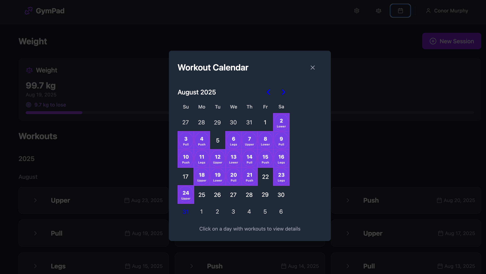

# Feedback

I have been using this for a while now and I have some feedback that I would like to address:

- I have noticed that when I am entering either reps or weights on mobile, if I accidentally hit return on the keyboard it will save the session, and then I have to go back into the session and edit it so that I can continue with the session. The same thing happens if I am in edit view, hitting return will save and exit the session. I want to change both the new session form and the edit session form so that when I hit enter, the workout doesn't save.

## EDIT

- I have also noticed that the days on the calender that show when a workout was complete by highlighting the day, the days are off sync by 1 day. So the most recent workout I completed was on 23th August, if I open the calender view, it has highlighted the 24rd
  
