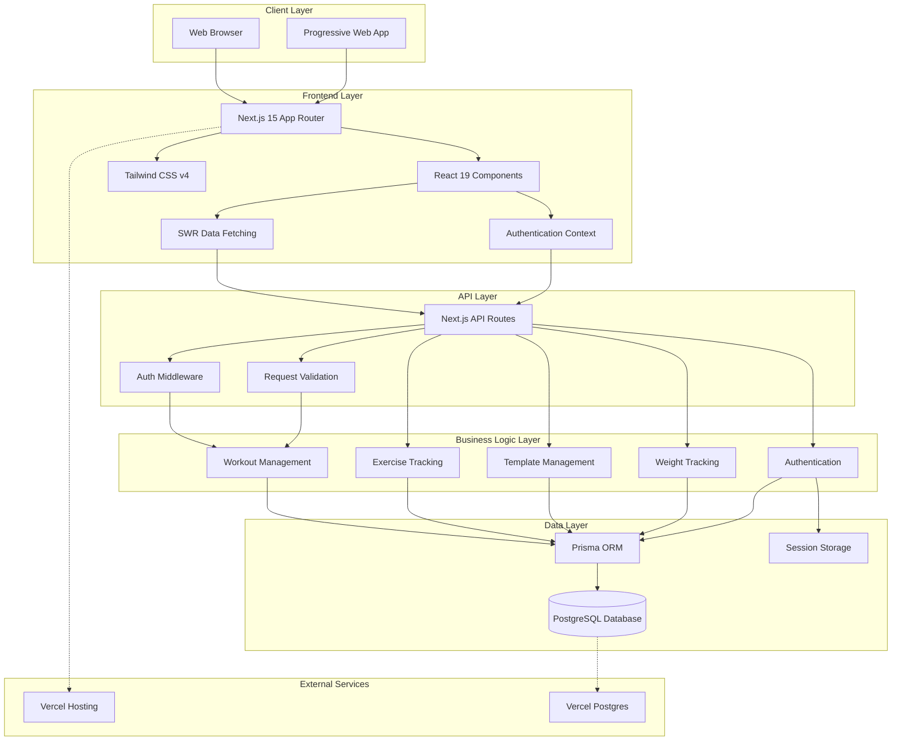
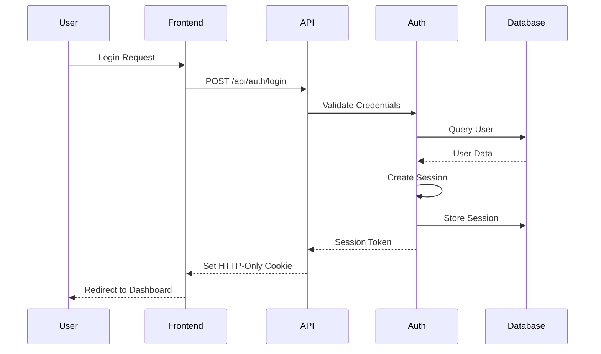
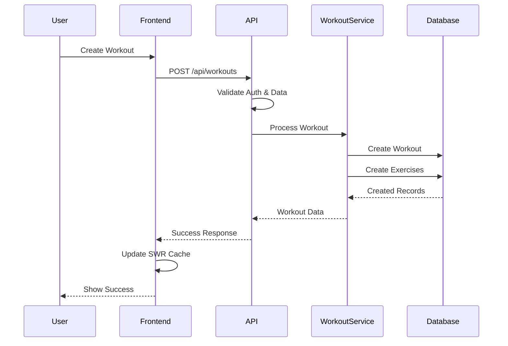
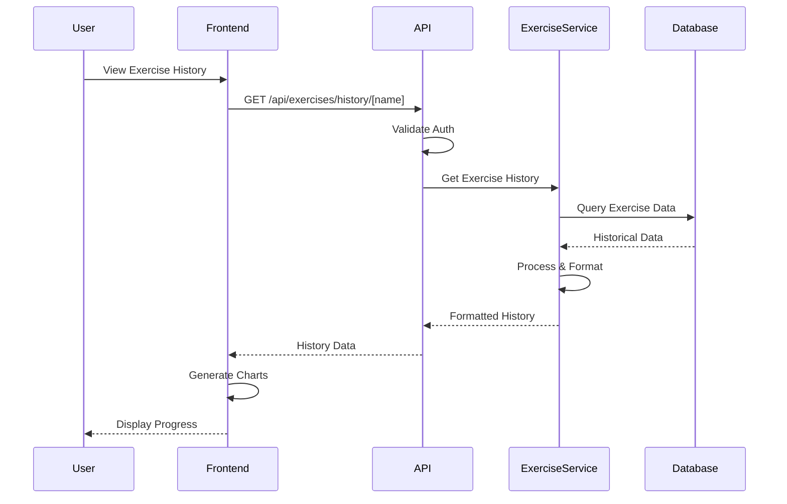

# Gym Pad Architecture Documentation

This document provides a comprehensive overview of the Gym Pad application architecture, including system design, component structure, and data flow.

## System Overview

Gym Pad is a fullstack web application built with Next.js that provides workout tracking, progress analytics, and weight monitoring capabilities. The application follows a modern, scalable architecture pattern.

## Architecture Diagram



## Technology Stack

### Frontend
- **Framework**: Next.js 15 with App Router
- **UI Library**: React 19
- **Styling**: Tailwind CSS v4
- **Icons**: Lucide React
- **Charts**: Recharts
- **Data Fetching**: SWR for client-side data synchronization
- **State Management**: React Context for authentication

### Backend
- **Runtime**: Node.js with Next.js API Routes
- **Database ORM**: Prisma
- **Database**: PostgreSQL (SQLite for development)
- **Authentication**: Session-based with HTTP-only cookies
- **Validation**: Custom validation functions

### Development & Deployment
- **Package Manager**: npm
- **Deployment**: Vercel
- **Database Hosting**: Vercel Postgres (production)
- **Version Control**: Git

## Application Layers

### 1. Client Layer
The client layer consists of web browsers and potential Progressive Web App (PWA) capabilities.

**Responsibilities:**
- Rendering the user interface
- Handling user interactions
- Managing client-side routing
- Caching and offline capabilities (future PWA)

### 2. Frontend Layer
The presentation layer built with Next.js and React.

**Key Components:**
- **Page Components**: Route-based components (`app/page.js`, `app/session/[id]/page.js`)
- **UI Components**: Reusable components (`components/`)
- **Context Providers**: Global state management (`contexts/AuthContext.jsx`)
- **Styling System**: Tailwind CSS for responsive design

**Component Architecture:**
```
components/
├── AuthForm.jsx          # Authentication forms
├── Dashboard.jsx         # Main dashboard
├── SessionForm.jsx       # Workout session creation
├── SessionDetail.jsx     # Workout session display
├── ExerciseItem.jsx      # Individual exercise component
├── ProgressChart.jsx     # Exercise progress visualization
├── WeightTracker.jsx     # Weight tracking interface
├── TemplateEditor.jsx    # Template creation/editing
└── CalendarView.jsx      # Workout calendar
```

### 3. API Layer
RESTful API endpoints built with Next.js API routes.

**Route Structure:**
```
app/api/
├── auth/
│   ├── login/route.js
│   ├── register/route.js
│   ├── logout/route.js
│   └── me/route.js
├── workouts/
│   ├── route.js
│   ├── [id]/route.js
│   ├── calendar/route.js
│   └── from-template/route.js
├── exercises/
│   ├── route.js
│   └── history/[name]/route.js
├── templates/
│   ├── route.js
│   ├── [id]/route.js
│   └── [id]/latest-data/route.js
└── weight/
    ├── route.js
    ├── [id]/route.js
    └── goal/route.js
```

**Middleware Chain:**
1. **Authentication Middleware**: Validates session tokens
2. **Request Validation**: Validates input data
3. **Business Logic**: Processes requests
4. **Response Formatting**: Standardizes API responses

### 4. Business Logic Layer
Core application logic organized by domain.

**Services:**
- **AuthService** (`lib/auth.js`): User authentication and session management
- **WorkoutService**: Workout CRUD operations and business rules
- **ExerciseService**: Exercise tracking and history
- **TemplateService**: Workout template management
- **WeightService**: Weight tracking and goal management

### 5. Data Layer
Data persistence and management.

**Components:**
- **Prisma ORM**: Database abstraction and query building
- **Database**: PostgreSQL for production, SQLite for development
- **Session Store**: Server-side session management
- **Migrations**: Database schema versioning

## Data Flow

### 1. User Authentication Flow


### 2. Workout Creation Flow


### 3. Progress Tracking Flow


## Security Architecture

### Authentication & Authorization
- **Session-based Authentication**: Secure HTTP-only cookies
- **CSRF Protection**: SameSite cookie attributes
- **Password Security**: Bcrypt hashing with salt
- **Session Management**: Automatic expiration and cleanup

### Data Protection
- **Input Validation**: Server-side validation for all inputs
- **SQL Injection Prevention**: Prisma ORM with parameterized queries
- **XSS Prevention**: React's built-in escaping
- **Data Isolation**: User-scoped queries prevent cross-user access

### API Security
- **Rate Limiting**: To be implemented
- **HTTPS Only**: Enforced in production
- **CORS Configuration**: Restricted origins
- **Error Handling**: Sanitized error messages

## Performance Considerations

### Frontend Optimization
- **Code Splitting**: Next.js automatic code splitting
- **Image Optimization**: Next.js Image component
- **Static Generation**: Pre-rendered pages where possible
- **Client-side Caching**: SWR for data synchronization

### Backend Optimization
- **Database Indexing**: Optimized queries with proper indexes
- **Connection Pooling**: Prisma connection management
- **Query Optimization**: Efficient database queries
- **Response Caching**: HTTP caching headers

### Deployment Optimization
- **Edge Deployment**: Vercel Edge Network
- **Static Assets**: CDN distribution
- **Database Location**: Co-located with application
- **Monitoring**: Performance metrics tracking

## Scalability Considerations

### Horizontal Scaling
- **Stateless API**: Session data stored in database
- **Database Scaling**: Read replicas for read-heavy operations
- **CDN Usage**: Static asset distribution
- **Microservices Ready**: Modular service architecture

### Vertical Scaling
- **Database Optimization**: Query performance tuning
- **Memory Management**: Efficient data structures
- **CPU Optimization**: Minimal processing overhead
- **Storage Efficiency**: Optimized data storage

## Development Workflow

### Code Organization
```
gym-pad/
├── app/                 # Next.js App Router
│   ├── api/            # API routes
│   ├── (pages)/        # Page components
│   └── globals.css     # Global styles
├── components/         # Reusable UI components
├── contexts/          # React contexts
├── lib/               # Utility functions and services
├── prisma/            # Database schema and migrations
├── docs/              # Documentation
└── tests/             # Test files
```

### Development Practices
- **Component-Driven Development**: Isolated, reusable components
- **API-First Design**: Well-defined API contracts
- **Database-First Approach**: Schema-driven development
- **Testing Strategy**: Unit and integration tests
- **Code Quality**: Linting and formatting standards

## Monitoring and Observability

### Logging
- **Structured Logging**: JSON-formatted logs
- **Error Tracking**: Comprehensive error reporting
- **Performance Metrics**: Response time monitoring
- **User Analytics**: Usage pattern tracking

### Health Checks
- **Database Connectivity**: Connection health monitoring
- **API Availability**: Endpoint health checks
- **Performance Metrics**: Response time tracking
- **Error Rates**: Error frequency monitoring

## Future Architecture Considerations

### Planned Enhancements
- **PWA Support**: Offline functionality
- **Real-time Features**: WebSocket integration
- **Mobile Apps**: React Native development
- **Advanced Analytics**: Machine learning integration
- **Social Features**: User interaction capabilities

### Technical Debt Management
- **Regular Refactoring**: Code quality maintenance
- **Dependency Updates**: Security and performance updates
- **Performance Optimization**: Continuous performance improvements
- **Documentation Updates**: Keep documentation current