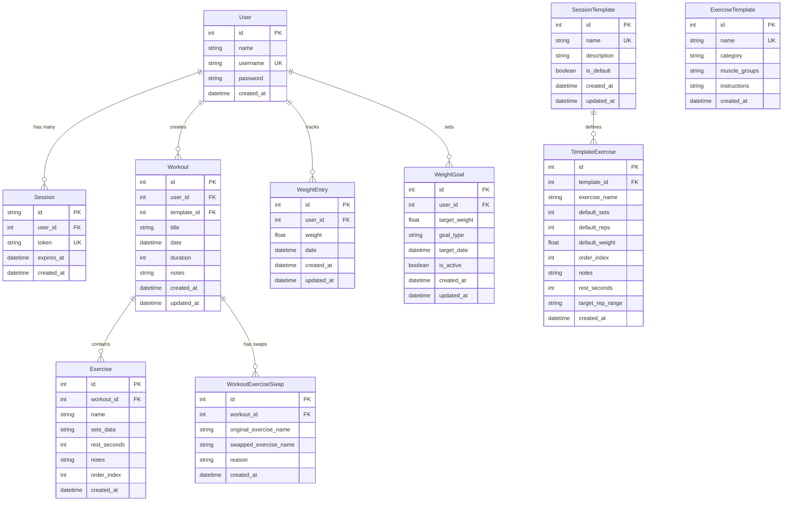

# Database Schema Documentation

This document describes the database schema for the Gym Pad application using PostgreSQL with Prisma ORM.

## Overview

The database consists of 8 main tables that handle user authentication, workout tracking, session templates, and weight monitoring.

## Database Diagram



## Table Descriptions

### User
Stores user account information and credentials.

**Columns:**
- `id` (Primary Key): Auto-incrementing user identifier
- `name`: Display name for the user
- `username` (Unique): Login username
- `password`: Hashed password
- `created_at`: Account creation timestamp

**Relationships:**
- One-to-many with Session (user sessions)
- One-to-many with Workout (user's workouts)
- One-to-many with WeightEntry (weight tracking)
- One-to-many with WeightGoal (weight goals)

### Session
Manages user authentication sessions with secure tokens.

**Columns:**
- `id` (Primary Key): CUID session identifier
- `user_id` (Foreign Key): References User.id
- `token` (Unique): Secure session token
- `expires_at`: Token expiration timestamp
- `created_at`: Session creation timestamp

**Relationships:**
- Many-to-one with User (session owner)

### Workout
Stores individual workout sessions.

**Columns:**
- `id` (Primary Key): Auto-incrementing workout identifier
- `user_id` (Foreign Key): References User.id
- `template_id` (Foreign Key, Optional): References SessionTemplate.id
- `title`: Workout session name
- `date`: When the workout was performed
- `duration`: Workout duration in seconds
- `notes`: Optional workout notes
- `created_at`: Record creation timestamp
- `updated_at`: Last modification timestamp

**Relationships:**
- Many-to-one with User (workout owner)
- One-to-many with Exercise (workout exercises)
- One-to-many with WorkoutExerciseSwap (exercise substitutions)

### Exercise
Stores individual exercises within a workout.

**Columns:**
- `id` (Primary Key): Auto-incrementing exercise identifier
- `workout_id` (Foreign Key): References Workout.id
- `name`: Exercise name (e.g., "Bench Press")
- `sets_data`: JSON string containing set details (reps, weight, completion)
- `rest_seconds`: Rest time between sets
- `notes`: Exercise-specific notes
- `order_index`: Position within the workout
- `created_at`: Record creation timestamp

**Relationships:**
- Many-to-one with Workout (parent workout)

**Sets Data Format:**
```json
[
  {"reps": 10, "weight": 135, "completed": true},
  {"reps": 8, "weight": 140, "completed": true}
]
```

### SessionTemplate
Defines reusable workout templates.

**Columns:**
- `id` (Primary Key): Auto-incrementing template identifier
- `name` (Unique): Template name (e.g., "Push Day")
- `description`: Template description
- `is_default`: Whether this is a default template
- `created_at`: Template creation timestamp
- `updated_at`: Last modification timestamp

**Relationships:**
- One-to-many with TemplateExercise (template exercises)

### TemplateExercise
Defines exercises within a session template.

**Columns:**
- `id` (Primary Key): Auto-incrementing identifier
- `template_id` (Foreign Key): References SessionTemplate.id
- `exercise_name`: Name of the exercise
- `default_sets`: Default number of sets
- `default_reps`: Default number of reps
- `default_weight`: Default weight
- `order_index`: Position within the template
- `notes`: Exercise notes
- `rest_seconds`: Default rest time
- `target_rep_range`: Target rep range (e.g., "8-12")
- `created_at`: Record creation timestamp

**Relationships:**
- Many-to-one with SessionTemplate (parent template)

### ExerciseTemplate
Master list of available exercises with metadata.

**Columns:**
- `id` (Primary Key): Auto-incrementing identifier
- `name` (Unique): Exercise name
- `category`: Exercise category (e.g., "Strength", "Cardio")
- `muscle_groups`: Target muscle groups
- `instructions`: Exercise instructions
- `created_at`: Record creation timestamp

### WorkoutExerciseSwap
Tracks when exercises are substituted during workouts.

**Columns:**
- `id` (Primary Key): Auto-incrementing identifier
- `workout_id` (Foreign Key): References Workout.id
- `original_exercise_name`: Original planned exercise
- `swapped_exercise_name`: Actual performed exercise
- `reason`: Reason for the substitution
- `created_at`: Record creation timestamp

**Relationships:**
- Many-to-one with Workout (parent workout)

### WeightEntry
Tracks user weight measurements over time.

**Columns:**
- `id` (Primary Key): Auto-incrementing identifier
- `user_id` (Foreign Key): References User.id
- `weight`: Weight measurement (float for precision)
- `date`: Date of the measurement
- `created_at`: Record creation timestamp
- `updated_at`: Last modification timestamp

**Relationships:**
- Many-to-one with User (weight owner)

### WeightGoal
Stores user weight goals and targets.

**Columns:**
- `id` (Primary Key): Auto-incrementing identifier
- `user_id` (Foreign Key): References User.id
- `target_weight`: Target weight goal
- `goal_type`: Type of goal ("weight_loss", "weight_gain", "maintenance")
- `target_date`: Optional target completion date
- `is_active`: Whether the goal is currently active
- `created_at`: Record creation timestamp
- `updated_at`: Last modification timestamp

**Relationships:**
- Many-to-one with User (goal owner)

## Indexes

The following indexes are automatically created by Prisma:

- `User.username` (unique)
- `Session.token` (unique)
- `SessionTemplate.name` (unique)
- `ExerciseTemplate.name` (unique)

## Constraints

### Foreign Key Constraints
- All foreign key relationships include proper referential integrity
- Cascade deletes are configured for dependent records:
  - Deleting a User cascades to Sessions, WeightEntries, and WeightGoals
  - Deleting a Workout cascades to Exercises and WorkoutExerciseSwaps
  - Deleting a SessionTemplate cascades to TemplateExercises

### Data Integrity
- Required fields enforce NOT NULL constraints
- Unique constraints prevent duplicate usernames, session tokens, etc.
- Default values are set for timestamps and boolean fields

## Migration History

The database schema has evolved through several migrations:

1. **20250728123707_init**: Initial schema setup
2. **20250731224000_add_auth_and_weight_tracking**: Added authentication and weight tracking
3. **20250731224500_fix_cascade_constraints**: Fixed cascade delete constraints

## Performance Considerations

### Query Optimization
- Foreign key indexes optimize JOIN operations
- Date fields on Workout and WeightEntry support time-based queries
- Order indexes on Exercise and TemplateExercise optimize sorting

### Data Storage
- Sets data is stored as JSON for flexibility
- Weight measurements use FLOAT for precision
- Text fields use appropriate VARCHAR lengths

## Backup and Recovery

### Recommended Practices
- Regular automated backups of the entire database
- Point-in-time recovery capability
- Separate backup of user-generated content (workout data)

### Data Retention
- Session tokens expire automatically
- Historical workout data is preserved indefinitely
- Weight tracking maintains complete history

## Security Considerations

### Data Protection
- Passwords are hashed before storage
- Session tokens are cryptographically secure
- User data is isolated by user_id foreign keys

### Access Control
- All queries are filtered by authenticated user
- No cross-user data access is possible
- Sensitive fields are not exposed in API responses